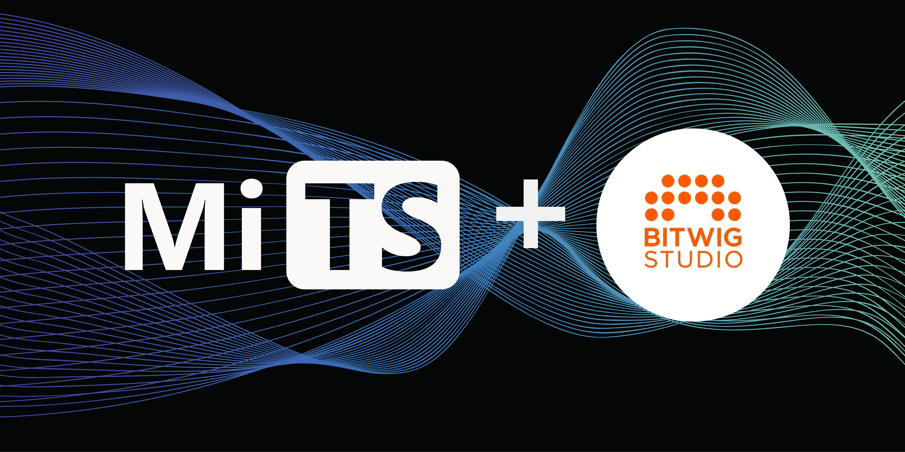

  

# Michigan TypeScript's Original Music

This repo contains the source files for all the original music used by [Michigan TypeScript](https://www.youtube.com/@MichiganTypeScript/videos).

## Arbitrary Limitations === Creative Freedom

Since limitations and restrictions foster creativity, a few arbitrary creative rules were put in place for all of this music:

1. all tracks are
    - made in [BitWig](https://www.bitwig.com)
    - use no extra samples
    - use no external plugins*
1. only 6 notes are allowed: `C` `E` `G` (C Major) and `F#` `A#` `C#` (F# Major).
    - And yes..  The hidden references to the C, C# and F# programming languages are intentional.  Coincidentally, since these two chords are a tritone apart, even though it's just 6 notes, there's lots of chromatic possibilities there that allow for interesting progressions which hint at (but don't ever arrive at) other chords (since using other notes would be breaking the rules).
    - There's no scale that fits these six notes (seriously, you are invited to try and find one).

_* only the very first two tracks used [Omnisphere](https://www.spectrasonics.net/products/omnisphere) before this rule was decided on_

## "but I just wanna listen to it"

> [!TIP]
>  If you wanna just hear a playlist of all the songs, you can find one on SoundCloud:
>
> **[soundcloud.com/michigan-typescript/sets](https://soundcloud.com/michigan-typescript/sets)**

## The Tracks

- Short Background Music
  - [Acid](./short-background/acid/README.md)
  - [Bells](./short-background/bells/README.md)
  - [Jungly Filtmix](./short-background/jungly-filtmix/README.md)
  - [Lofi](./short-background/lofi/README.md)
  - [Magnetic Drums](./short-background/magnetic-drums/README.md)
  - [Outer Spectra](./short-background/outer-spectra/README.md)
  - [Perfect Drift](./short-background/perfect-drift/README.md)
- Long Background Music
  - [Pineal](./long-background/pineal/README.md)
- Intros/Outros
  - [Live Talks](./intros-outros/live-talks/README.md)
  - [Maintain](./intros-outros/maintain/README.md)
  - [Release Report](./intros-outros/release-report/README.md)
  - [Showcase](./intros-outros/showcase/README.md)
  - [Theorycraft](./intros-outros/theorycraft/README.md)
  - [Type Challenges](./intros-outros/type-challenges/README.md)

Enjoy!

_By the way.. if you wanna use this music for your own things just ask on [the MiTS discord](https://discord.michigantypescript.com) and we'll be sure to say yes!_